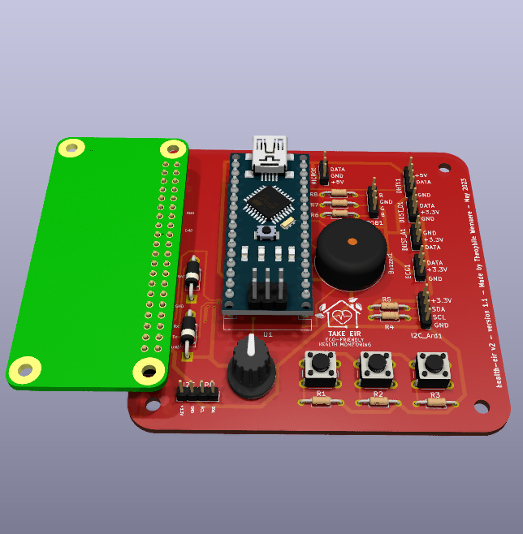

# HEALTH-EIR v2.0

Arduino lib :
https://github.com/g200kg/kicad-lib-arduino



````i```
Problemes :
- footprints for headers are not standards
- there was a problem on the RX-TX communication between rpi and arduino, resulting in the rpi frying 

```````
